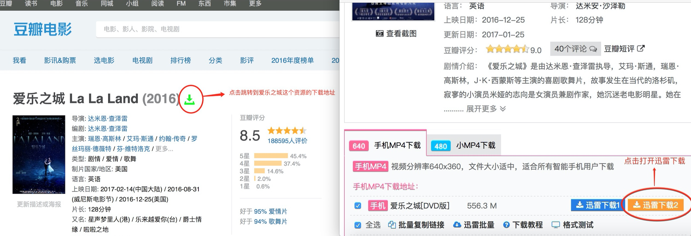

# 豆瓣电影资源指引插件  

### 工具介绍
这是一个需要自行解压的运行在chrome浏览器上的插件。前几天看了[@羡澈](http://zhangwenli.com/blog/2014/09/01/readfree-chrome-extension/)大神写的豆瓣读书跳转到Readme上下载电子书的地址，所以闲着没事就写了一个电影的跳转。
### 实现功能
在豆瓣电影介绍页面自动添加一个下载按钮，点击可以直接传送到该电影的可下载资源的地址，当然了，前提是要找得到资源才行。我写了一个爬虫事先爬取了电影下载网站中有资源，离线为一个哈希表供插件搜索。

### 使用方法
- 下载chrome插件

### 注意
- 使用这个插件目前只支持chrome浏览器。
- 目前只有豆瓣电影的详情页有添加按钮。
- 暂时只爬取了80s电影网的所有视频资源，也就是说如果80s上没有资源，那么按钮就不会出现了。
